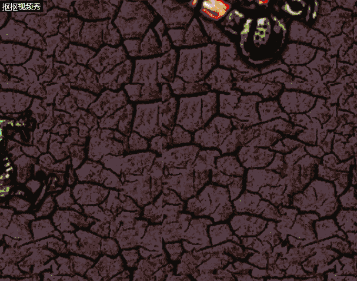

# 第一次用Construct 2 制作 html5 游戏
### 首先，登陆Construct 2 网站下载Construct 2 免费版
.png) .png)
> 以上是 Construct 2 的简单介绍 （夸一下网站制作十分精美 设计排版优良）
### 安装完成后可以在Construct 2 上选择想要制作的游戏的教程
.png)
> 网址 : [教程网址](https://www.scirra.com/tutorials/top)
### 接下来的游戏制作只要按照指南一步步来就好 基本上问题不大 
> 对于新手提醒一点 要注意condition与action的逻辑关系 满足条件触发动作 在event sheet 中 每个event 要记得分格写一一对应 否则会出现错误
 >>另外，建议在看教程时 建议看英文不要翻译 这样在Construct 2 软件上找对应名词时 会更加精准
### 游戏制作完成后 就可以自由快乐地玩耍了
> 由于完全新手 所以选择了最简单的第一个教程 “子弹打怪兽”
成果Gif图
> 
（文件大了点所以压缩了 画质变差 ）
