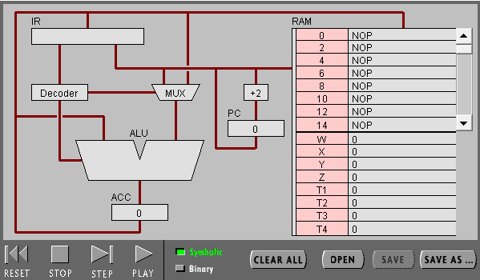
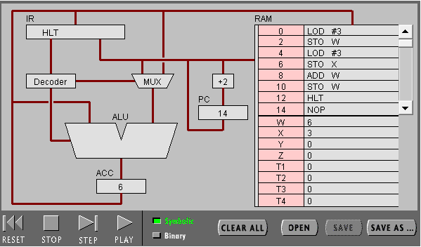
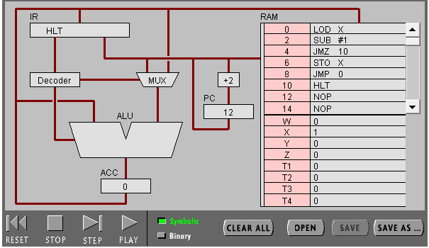

## 硬件编程–机器指令编程-实验报告
实验者：张泽健  
学号：18342133

### 目录

* [1.实验目标](#1)

* [2.实验步骤与结果](#2)

* [3.实验小结](#3)

<h3 id = "1">1.实验目标</h3>
1. 理解冯·诺伊曼计算机的结构
2. 理解机器指令的构成
3. 理解机器指令执行周期
4. 用汇编编写简单程序

<h3 id = "2">2.实验步骤与结果</h3>

实验界面 
### 一、简单程序
#### Progarm1 : Add 2 numbers. 
实验输入 执行完成： 
### 观察并且回答下列问题
##### 1. PC，IR 寄存器的作用。
PC的作用：程序计数器  
为了保证程序能够连续地执行下去，CPU必须具有某些手段来确定下一条指令的地址,PC起的就是这个作用 
IR的作用：指令寄存器 
是用来存放指令的，存放当前正在执行的指令，包括指令的操作码，地址码，地址信息。 
##### 2. ACC 寄存器的全称与作用。
ACC（Accumulator）是累加器A缩写。累加器A是一个具有特殊用途的二进制8位寄存器，专门用来存放操作数或运算结果。
##### 3. 用“LOD #3”指令的执行过程，解释Fetch-Execute周期。

> 1. PC根据地址从RAM中取出指令LOD #3
> 2. 指令传入IR，然后， 指令传入Decoder， 数字3传入MUX
> 3. 数字3传入ALU， 之后传入ACC
##### 4. 用“ADD W” 指令的执行过程，解释Fetch-Execute周期。
> 1. PC从RAM中拿出指令ADD W
> 2. 指令传入IR 再传入Decoder
> 3. ALU从ACC中取值7
> 4. IR再次访问RAM中的W，从W中取值3，将W中的值读入ALU
> 5. ALU执行加法，最后将结果传入ACC

##### 5. “LOD #3” 与 “ADD W” 指令的执行在Fetch-Execute周期级别，有什么不同。 
LOD #3访问内存一次 而 ADD W 访问内存两次 
ADD W 中有直接从ACC中取值的操作 ， 不用访问内存
##### 1. 写出指令 “LOD #7” 的二进制形式，按指令结构，解释每部分的含义。
00010100(步骤操作) 00000111（操作数）
##### 2. 解释 RAM 的地址。
RAM的数字地址 0 2 4 6 8 ++2递增的 这样八位数可以存储56个地址
##### 3. 该机器CPU是几位的？（按累加器的位数）
16位
##### 4. 写出该程序对应的 C语言表达。
int w = 3;
int x = 7;
int z = x + w;

### 二、简单循环
#### Program 2
1. 用一句话总结程序的功能
使x从3每次减1直到为0；
c语言程序：
         int x = 3; 
         while(x>0)
         {
         x--;
            }
    
2. 修改该程序，用机器语言实现 10+9+8+..1 ，输出结果存放于内存 Y
  1) 写出 c 语言的计算过程
      
      
          int Y=0;
          for ( int X = 10；X>0;--X )
          {
          Y + = X；
          }
  
  
  2)写出机器语言的计算过程
                  
                  
                  0000000 00010100 00001010
                  0000010 00000101 10000001
                  0000100 00010001 00000001
                  0000110 00000101 10000000
                  0001000 00000000 10000001
                  0001010 00000101 10000000
                  0001100 00000100 10000000
                  0001110 00001101 00010010
                  0010000 00001100 00000100
                  0010010 00000101 10000010
                  0010100 00001111 00000000
                  0010110 00001110 00000000
                  1000000 00000011
                  1000001 00000111
                  1000010 00001010
                  1000011 00000000

3.用自己的语言，简单总结高级语言与机器语言的区别与联系。 
区别：高级语言不能直接被机器识别 ， 但便于人类编写程序 ；机器语言可以直接被机器识别，但是不便于人类编写程序； 
联系:高级语言可以编译来传换成机器语言
<h3 id = "3">3.实验小结</h3>
通过这次实验，本人了解了机器语言指令的构造 复习了IR PC ACC 等等概念，初步了解汇编语言，对cpu是怎样工作的有了初步的认识，以及了解了高级语言汇编语言和机器语言之间可以互相转换。
