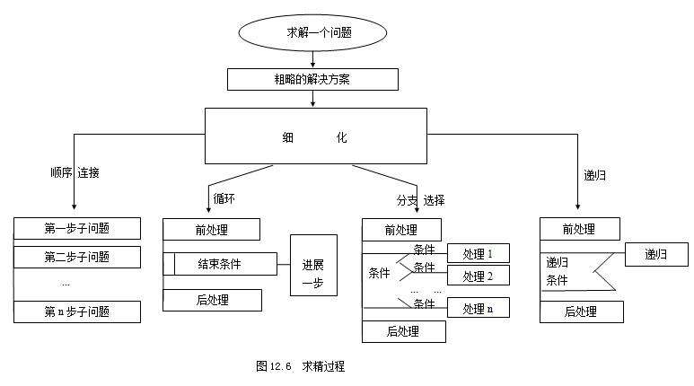

## 自顶而下，逐步取精的编程方法的简介



### 自顶向下
		
		一种程序开发技术，其中问题被分解成更容易处理的子问题，这些子问题的解决方案组合起来构成整体问题的解决方案。自顶向下设计最初把问题分解成一套子问题，然后把子问题分解成子问题。这一过程将一直持续到每个子问题足够基础，不再需要进一步分解为止。我们创造了一种分层结构来表示问题和子问题（称为模块）之间的关系，这种结构也称为树形结构。在树形结构中，每一层的模块都可以调用下层模块的服务。这些模块是算法的基本构件。

### 逐步求精
				
		将现实问题经过几次抽象（细化）处理，最后到求解域中只是一些简单的算法描述和算法实现问题。即将系统功能按层次进行分解，每一层不断将功能细化，到最后一层都是功能单一、简单易实现的模块。求解过程可以划分为若干个阶段，在不同阶段采用不同的工具来描述问题。在每个阶段有不同的规则和标准，产生出不同阶段的文档资料。


个人看法：自顶而下，逐步求精其实就是将一个大的事件不断地去多维度的分解，直到分解到最后每一个步骤都是可以简单执行的操作为止。这种分析解决的思维，其实不止可以运用到编程上来，也可以运用来解决好生活中的其他事情。


> 下面以洗衣机为例简单说明 “自顶而下，逐步求精”

若是我们对洗衣机使用“自顶而下，逐步求精”的分析方法，那么我们想到要使用这台洗衣机，就要了解到它有什么功能，再来分析这些功能需要什么过程来实现，再来讨论过程中各种因素的控制等等，到了这一步，我们就可以利用程序来实现，就可以将问题分解到可以具体执行的步骤了。
			
		正常而言，一个洗衣机程序，不可缺少的必然有进水，洗涤（漂洗），排水，脱水等程序。 
		而将它们分别用代码实现，则又需要思考设计它们分别的实现方式，比如说，脱水的时间、进水的时间或量、以及洗涤时洗衣机滚轴的转动方式等等。
#### 1）这是步骤的简单解释
```
1.选择洗衣模式以及对应水位，注水时间；
2.注水，水位器计算水位；
3.浸泡，计时器计时；
4.电机转动，左三次，右三次；
5.排水，计水器计算水位；
6.点击转动脱水；
7.结束洗衣；
```
#### 2）这是根据每个步骤写出的伪代码
```
1.READ 用户选择模式
2.WHILE (水位<注水水位)
注水water_in_switch(open) 
get_water_volume() //返回洗衣机内部水的高度
3.IF （设置浸泡时间>0）
浸泡 ；
--设置浸泡时间；
4.WHILE(电机转动时间>0)
	FOR（电机转动时间=A;电机转动时间>=0;--电机转动时间）
	1.motor_run(left) 
	2.motor_run(right) 
	3.motor_run(stop) 
END WHILE;
5.c=get_water_volume() //返回洗衣机内部水的高度
WHILE(c!=0)
water_out_switch(close)
ENDWHILE;
6.FOR(设置脱水时间>0)
		电机转动
ENDFOR
7.关机halt(returncode)
```

### 以上。
##### 通过对“自上而下，逐步求精”的编程方法的学习，我对程序设计甚至是其他事情的处理，也有了更加清晰的认识。
