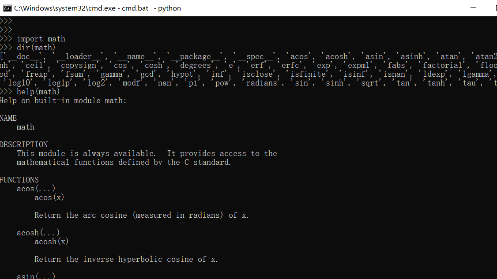
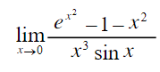
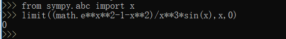
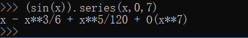
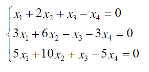
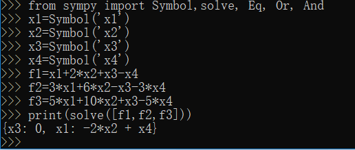
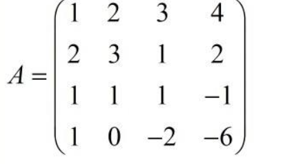
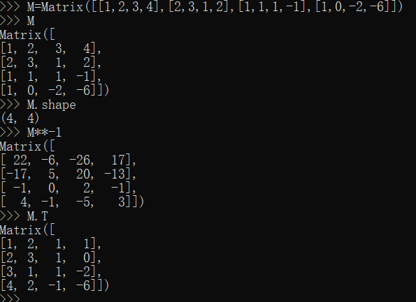

# python实验编程语言实验报告

## 实验名称：用python做计算器，做数学题
#### 实验者姓名 ：张泽健 
#### 学号 18342133

## 目录
1.[实验目的](#1) 

2.[实验步骤与结构](#2) 

3.[实验小结](#3) 

<h3 id="1">1.实验目的：<h3/>	
1.了解一种“解释型”语言 python  
2.使用 python 做一些简单的科学计算 
3.使用python求解高数题目以及线代题目 

<h3 id="2">2.实验步骤与结果：<h3/>
###   实验前准备 
1.软件准备:下载winpython

2.了解实验环境，基本操作学习

### 实验一 ： 使用python解决高数题目
第一步，导入math 和 sympy 库
题目一：求极限    
题目二：泰勒展开
求解sin(x)的泰勒展开

### 实验二 ： 使用python解决线性代数题目
题目一：解方程

题目二：矩阵处理
原始矩阵：
1.获取行列!
2.求逆矩阵!
3.获得转置矩阵

<h3 id="3">3.实验小结：</h3>
通过本次运用python做数学题的实验，我学会了如何运用python对高数与线代一些难以通过搜索引擎搜出答案的题目进行求解，这为以后的数学方面的研究提供了一种新的可靠的答案提供方案。
