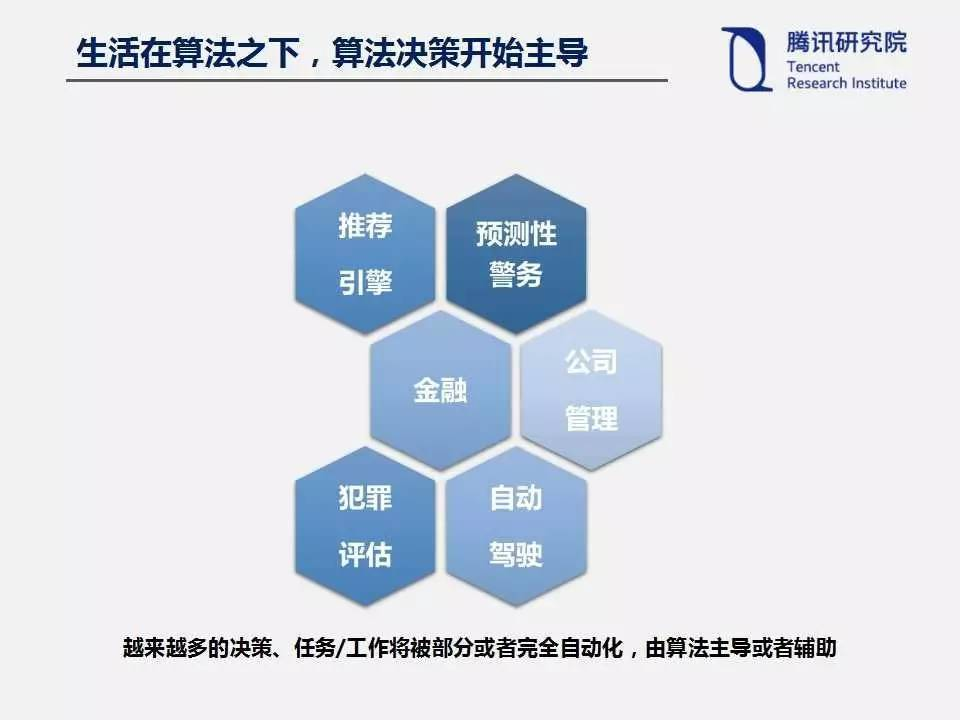
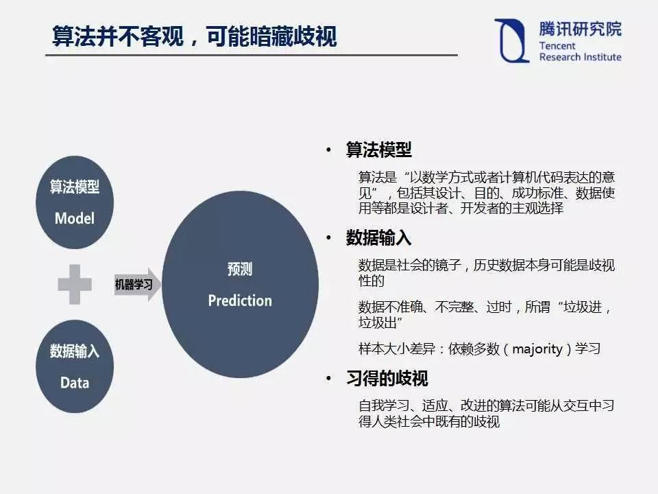
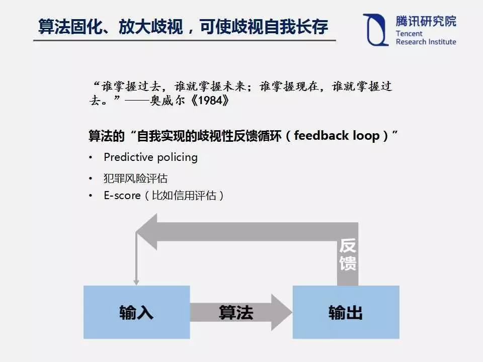

### AI算法决策技术与伦理道德
人工智能的持续进步和广泛发展对人类来说当然是有益的。但是，为了让AI技术更好地服务于人类，创造出对人类有价值地工作，我们也不能忽视其背后地道德伦理问题。
接下来，我将展出关于算法决策的伦理道德上的讨论。
#### 算法歧视。
##### 算法虽是一种数学表达，但实际上也会存在“误判”的空间。
例如，一些图像识别软件之前错误地将黑人识别为“猿猴”或者“黑猩猩”。
此外，2016年3月，微软公司在美国的Twitter上上线的聊天机器人Tay在与网民互动过程中，成为了一个集性别歧视、种族歧视等于一身的“不良少女”。
随着算法决策越来越多，类似的歧视也会越来越多。而且，算法歧视会带来危害。
一方面，如果将算法应用在犯罪评估、信用贷款、雇佣评估等关切人身利益的场合，一旦产生歧视，必然危害个人权益。
另一方面，深度学习是一个典型的“黑箱”算法，连设计者可能都不知道算法如何决策，要在系统中发现有没有存在歧视和歧视根源，在技术上是比较困难的。
##### 为什么算法并不客观，可能暗藏歧视？算法决策在很多时候其实就是一种预测，用过去的数据预测未来的趋势。算法模型和数据输入决定着预测的结果。因此，这两个要素也就成为算法歧视的主要来源。
一方面，算法在本质上是“以数学方式或者计算机代码表达的意见”，包括其设计、目的、成功标准、数据使用等等都是设计者、开发者的主观选择，设计者和开发者可能将自己所怀抱的偏见嵌入算法系统。另一方面，数据的有效性、准确性，也会影响整个算法决策和预测的准确性。比如，数据是社会现实的反映，训练数据本身可能是歧视性的，用这样的数据训练出来的AI系统自然也会带上歧视的影子；再比如，数据可能是不正确、不完整或者过时的，带来所谓的“垃圾进，垃圾出”的现象；更进一步，如果一个AI系统依赖多数学习，自然不能兼容少数族裔的利益。此外，算法歧视可能是具有自我学习和适应能力的算法在交互过程中习得的，AI系统在与现实世界交互过程中，可能没法区别什么是歧视，什么不是歧视。
##### 更进一步，算法倾向于将歧视固化或者放大，使歧视自我长存于整个算法里面。
算法决策是在用过去预测未来，而过去的歧视可能会在算法中得到巩固并在未来得到加强，因为错误的输入形成的错误输出作为反馈，进一步加深了错误。最终，算法决策不仅仅会将过去的歧视做法代码化，而且会创造自己的现实，形成一个“自我实现的歧视性反馈循环”。包括预测性警务、犯罪风险评估、信用评估等都存在类似问题。归根到底，算法决策其实缺乏对未来的想象力，而人类社会的进步需要这样的想象力。

> 此观点来源于知乎 作者腾讯公司腾讯研究院高级研究员曹建峰（Jeff Cao）
[阅读原文](https://cloud.tencent.com/developer/article/1033312)
